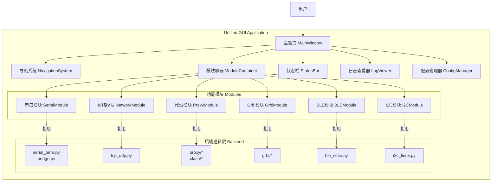
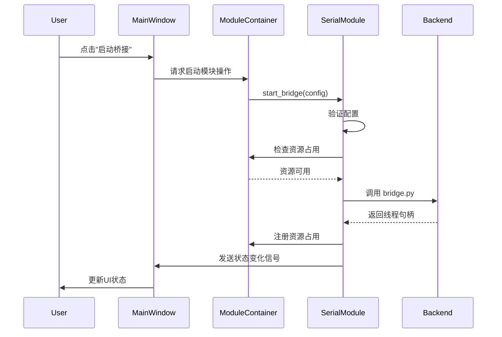
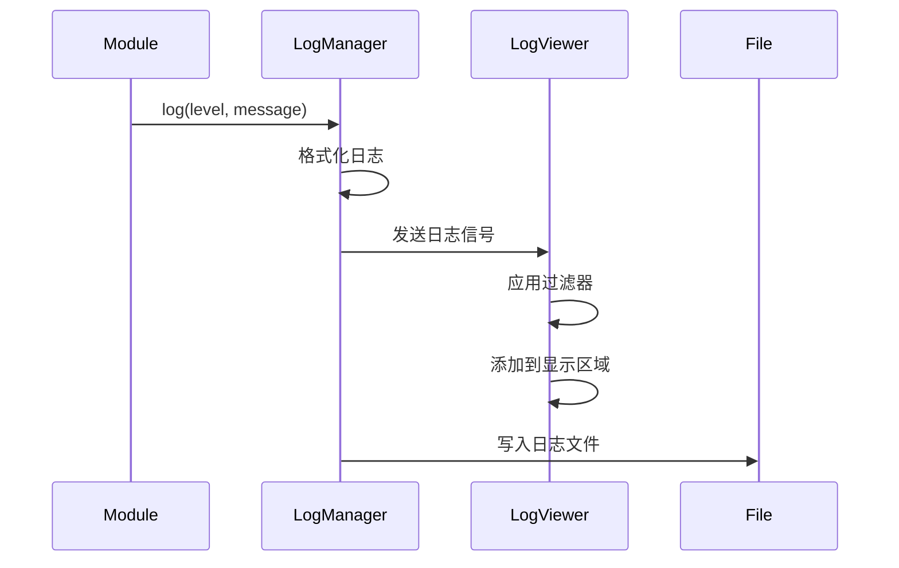
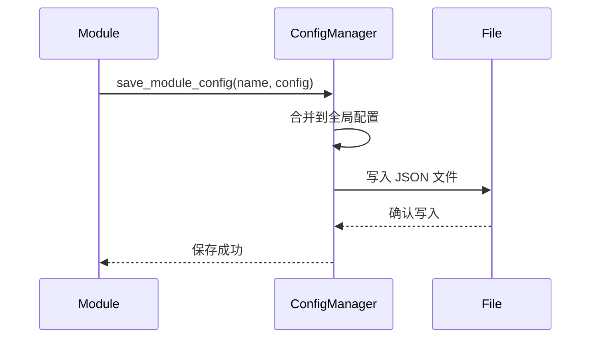

# 技术设计文档：统一图形界面（Unified GUI）

## 概述

统一图形界面（Unified GUI）是 linktunnel 项目的集成式桌面应用程序，旨在将所有独立功能模块（串口工具、网络中继、代理管理、Grbl CNC 控制、BLE 蓝牙扫描、Linux I2C 扫描）整合到一个现代化的用户界面中。

本设计采用模块化插件架构，复用现有的后端逻辑代码，提供统一的配置管理、日志系统和用户体验。设计参考了 RYCOM（QT/C++ 串口调试助手）和 Clash Verge Rev（Tauri/Rust 代理管理 GUI）的优秀设计理念。

### 设计目标

1. 提供统一的用户入口，降低学习成本
2. 支持多模块协同工作，提升调试效率
3. 保持向后兼容，不影响现有 CLI 工具
4. 跨平台支持（Windows、macOS、Linux）
5. 模块化架构，便于维护和扩展

### 技术栈选择

基于项目现状和需求分析，推荐采用 **PyQt6/PySide6** 作为主要实现方案，同时保留 **tkinter** 作为零依赖备选方案。

**方案对比：**

| 特性 | PyQt6/PySide6 | tkinter |
|------|---------------|---------|
| 依赖 | 需要安装 | Python 内置 |
| UI 现代化 | 优秀（Material Design 风格） | 基础（传统桌面风格） |
| 跨平台 | 优秀 | 良好 |
| 性能 | 优秀 | 良好 |
| 主题支持 | 丰富（内置深色/浅色模式） | 有限 |
| 布局系统 | 强大（QLayout） | 基础（pack/grid/place） |
| 控件丰富度 | 丰富 | 基础 |
| 社区支持 | 活跃 | 稳定 |
| 学习曲线 | 中等 | 简单 |

**推荐方案：PyQt6/PySide6**

理由：
- 现代化 UI 设计，符合用户期望
- 丰富的控件和布局系统，便于实现复杂界面
- 内置主题系统，支持深色/浅色模式
- 更好的性能和响应速度
- 项目已有 pywebview 依赖，用户接受额外 GUI 库

**备选方案：tkinter**

适用场景：
- 用户环境受限，无法安装额外依赖
- 需要快速原型验证
- 保持与现有 client_app.py 的一致性

## 架构设计

### 系统架构图



### 分层架构

```
┌─────────────────────────────────────────────────────────┐
│                    表示层 (Presentation)                 │
│  MainWindow, NavigationSystem, ModuleContainer          │
│  StatusBar, LogViewer, Dialogs                          │
└─────────────────────────────────────────────────────────┘
                            │
┌─────────────────────────────────────────────────────────┐
│                    模块层 (Module)                       │
│  SerialModule, NetworkModule, ProxyModule               │
│  GrblModule, BLEModule, I2CModule                       │
│  (每个模块实现 BaseModule 接口)                         │
└─────────────────────────────────────────────────────────┘
                            │
┌─────────────────────────────────────────────────────────┐
│                    服务层 (Service)                      │
│  ConfigManager, LogManager, ThreadManager               │
│  ResourceManager, EventBus                              │
└─────────────────────────────────────────────────────────┘
                            │
┌─────────────────────────────────────────────────────────┐
│                    后端层 (Backend)                      │
│  serial_term.py, tcp_udp.py, proxy/*, clash/*           │
│  grbl/*, ble_scan.py, i2c_linux.py                      │
│  (复用现有代码，保持向后兼容)                            │
└─────────────────────────────────────────────────────────┘
```

## 组件和接口设计

### 核心组件

#### 1. MainWindow（主窗口）

主窗口是应用程序的顶层容器，负责整体布局和生命周期管理。

**职责：**
- 初始化应用程序
- 管理窗口布局（导航系统 + 模块容器 + 状态栏）
- 处理全局快捷键
- 管理应用程序退出流程

**接口：**

```python
class MainWindow(QMainWindow):
    def __init__(self, config_manager: ConfigManager):
        """初始化主窗口"""
        
    def setup_ui(self) -> None:
        """设置用户界面布局"""
        
    def setup_menu(self) -> None:
        """设置菜单栏"""
        
    def setup_shortcuts(self) -> None:
        """设置全局快捷键"""
        
    def switch_module(self, module_name: str) -> None:
        """切换到指定模块"""
        
    def closeEvent(self, event: QCloseEvent) -> None:
        """处理窗口关闭事件"""
```

#### 2. NavigationSystem（导航系统）

导航系统提供模块切换功能，支持侧边栏和标签页两种模式。

**职责：**
- 显示可用模块列表
- 处理模块切换请求
- 高亮当前活动模块
- 显示模块运行状态指示器

**接口：**

```python
class NavigationSystem(QWidget):
    module_changed = pyqtSignal(str)  # 模块切换信号
    
    def __init__(self, mode: str = "sidebar"):
        """初始化导航系统
        
        Args:
            mode: "sidebar" 或 "tabs"
        """
        
    def add_module(self, name: str, display_name: str, icon: QIcon) -> None:
        """添加模块到导航"""
        
    def set_active_module(self, name: str) -> None:
        """设置当前活动模块"""
        
    def set_module_status(self, name: str, running: bool) -> None:
        """设置模块运行状态指示器"""
```


#### 3. ModuleContainer（模块容器）

模块容器负责管理和显示各个功能模块的界面。

**职责：**
- 加载和卸载模块
- 管理模块生命周期
- 提供模块间通信机制
- 处理模块资源占用冲突

**接口：**

```python
class ModuleContainer(QWidget):
    def __init__(self, config_manager: ConfigManager, log_manager: LogManager):
        """初始化模块容器"""
        
    def register_module(self, module: BaseModule) -> None:
        """注册功能模块"""
        
    def show_module(self, name: str) -> None:
        """显示指定模块"""
        
    def get_active_module(self) -> BaseModule | None:
        """获取当前活动模块"""
        
    def stop_all_modules(self) -> None:
        """停止所有运行中的模块"""
```

#### 4. BaseModule（模块基类）

所有功能模块必须继承此基类，实现统一的接口。

**职责：**
- 定义模块生命周期方法
- 提供配置加载/保存接口
- 提供日志输出接口
- 提供资源占用声明接口

**接口：**

```python
class BaseModule(QWidget):
    status_changed = pyqtSignal(str)  # 状态变化信号
    log_message = pyqtSignal(str, str)  # 日志消息信号 (level, message)
    
    def __init__(self, config_manager: ConfigManager, log_manager: LogManager):
        """初始化模块"""
        
    @abstractmethod
    def get_module_name(self) -> str:
        """返回模块名称"""
        
    @abstractmethod
    def get_display_name(self) -> str:
        """返回显示名称"""
        
    @abstractmethod
    def get_icon(self) -> QIcon:
        """返回模块图标"""
        
    def on_activate(self) -> None:
        """模块被激活时调用"""
        
    def on_deactivate(self) -> None:
        """模块被停用时调用"""
        
    def load_config(self) -> dict:
        """加载模块配置"""
        
    def save_config(self, config: dict) -> None:
        """保存模块配置"""
        
    def get_occupied_resources(self) -> list[str]:
        """返回当前占用的资源列表（如串口路径）"""
        
    def stop(self) -> None:
        """停止模块运行"""
```

#### 5. LogViewer（日志查看器）

统一的日志查看器，显示所有模块的日志输出。

**职责：**
- 接收并显示日志消息
- 支持日志级别过滤
- 支持日志搜索
- 支持日志导出和清空

**接口：**

```python
class LogViewer(QWidget):
    def __init__(self):
        """初始化日志查看器"""
        
    def append_log(self, level: str, module: str, message: str) -> None:
        """添加日志条目"""
        
    def set_filter_level(self, level: str) -> None:
        """设置日志级别过滤"""
        
    def search(self, keyword: str) -> None:
        """搜索日志内容"""
        
    def clear(self) -> None:
        """清空日志"""
        
    def export_to_file(self, filepath: str) -> None:
        """导出日志到文件"""
```

#### 6. ConfigManager（配置管理器）

管理应用程序和各模块的配置。

**职责：**
- 加载和保存配置文件
- 提供配置读写接口
- 支持配置导入/导出
- 处理配置文件损坏情况

**接口：**

```python
class ConfigManager:
    def __init__(self, config_dir: Path):
        """初始化配置管理器"""
        
    def load_config(self) -> dict:
        """加载全局配置"""
        
    def save_config(self, config: dict) -> None:
        """保存全局配置"""
        
    def get_module_config(self, module_name: str) -> dict:
        """获取模块配置"""
        
    def set_module_config(self, module_name: str, config: dict) -> None:
        """设置模块配置"""
        
    def export_config(self, filepath: str) -> None:
        """导出配置到文件"""
        
    def import_config(self, filepath: str) -> None:
        """从文件导入配置"""
        
    def reset_to_default(self) -> None:
        """恢复默认配置"""
```

### 功能模块设计

#### 1. SerialModule（串口工具模块）

**功能：**
- 串口列表刷新和显示
- 串口桥接配置和运行
- 串口调试终端

**界面布局：**

```
┌─────────────────────────────────────────────────────────┐
│ [串口列表] [刷新]                                        │
│ ┌─────────────────────────────────────────────────────┐ │
│ │ COM1 (USB Serial Port)                              │ │
│ │ COM3 (Bluetooth Serial)                             │ │
│ └─────────────────────────────────────────────────────┘ │
│                                                          │
│ [标签页: 串口桥接 | 调试终端]                            │
│ ┌─────────────────────────────────────────────────────┐ │
│ │ 端口A: [COM1▼]  波特率: [115200▼]                   │ │
│ │ 端口B: [COM3▼]  数据位: [8▼] 停止位: [1▼]          │ │
│ │ [启动桥接] [停止]  □ 十六进制日志                   │ │
│ │                                                      │ │
│ │ 接收区域:                                            │ │
│ │ ┌──────────────────────────────────────────────────┐│ │
│ │ │ [日志输出...]                                    ││ │
│ │ └──────────────────────────────────────────────────┘│ │
│ │ RX: 1024 bytes  TX: 512 bytes                       │ │
│ └─────────────────────────────────────────────────────┘ │
└─────────────────────────────────────────────────────────┘
```

**关键实现：**

```python
class SerialModule(BaseModule):
    def __init__(self, config_manager, log_manager):
        super().__init__(config_manager, log_manager)
        self.bridge_thread: threading.Thread | None = None
        self.term_thread: threading.Thread | None = None
        self.occupied_ports: set[str] = set()
        
    def refresh_serial_list(self) -> None:
        """刷新串口列表（调用 serial_util.py）"""
        
    def start_bridge(self, port_a: str, port_b: str, config: dict) -> None:
        """启动串口桥接（调用 bridge.py）"""
        
    def start_terminal(self, port: str, config: dict) -> None:
        """启动调试终端（调用 serial_term.py）"""
        
    def stop(self) -> None:
        """停止所有串口操作"""
```

#### 2. NetworkModule（网络中继模块）

**功能：**
- TCP 中继配置和运行
- UDP 中继配置和运行
- 实时流量监控

**界面布局：**

```
┌─────────────────────────────────────────────────────────┐
│ [标签页: TCP中继 | UDP中继]                              │
│ ┌─────────────────────────────────────────────────────┐ │
│ │ 监听地址: [127.0.0.1]  端口: [9000]                 │ │
│ │ 目标地址: [example.com]  端口: [80]                 │ │
│ │ □ 十六进制日志  □ IPv6                              │ │
│ │ [启动中继] [停止]                                    │ │
│ │                                                      │ │
│ │ 状态: 运行中  连接数: 3                             │ │
│ │ 上行: 1.2 MB  下行: 3.4 MB                          │ │
│ │                                                      │ │
│ │ 数据流日志:                                          │ │
│ │ ┌──────────────────────────────────────────────────┐│ │
│ │ │ [tcp] client->upstream: 48 bytes                ││ │
│ │ │ [tcp] upstream->client: 1024 bytes              ││ │
│ │ └──────────────────────────────────────────────────┘│ │
│ └─────────────────────────────────────────────────────┘ │
└─────────────────────────────────────────────────────────┘
```

**关键实现：**

```python
class NetworkModule(BaseModule):
    def __init__(self, config_manager, log_manager):
        super().__init__(config_manager, log_manager)
        self.tcp_thread: threading.Thread | None = None
        self.udp_thread: threading.Thread | None = None
        
    def start_tcp_relay(self, listen_addr: str, target_addr: str, config: dict) -> None:
        """启动 TCP 中继（调用 tcp_udp.py）"""
        
    def start_udp_relay(self, listen_addr: str, target_addr: str, config: dict) -> None:
        """启动 UDP 中继（调用 tcp_udp.py）"""
        
    def stop(self) -> None:
        """停止所有网络中继"""
```

#### 3. ProxyModule（代理管理模块）

**功能：**
- 整合现有 client_app.py 功能
- 代理配置初始化
- 节点管理和切换
- 浏览器控制台打开

**界面布局：**

```
┌─────────────────────────────────────────────────────────┐
│ API: [http://127.0.0.1:9090]  Secret: [****]  [复制API]│
│ □ 从 profile 读取  [连接/刷新] □ 自动刷新 [5▼]秒      │
│                                                          │
│ 内核: Mihomo v1.18.0  模式: [rule▼] [应用]             │
│ 监听: mixed:7890 http:7891  连接数: 5                   │
│                                                          │
│ 筛选: [_______]  [测延迟] [关闭全部连接] [打开控制台]  │
│ ┌─────────────────────────────────────────────────────┐ │
│ │ ▼ GLOBAL (当前: 香港节点01)                         │ │
│ │   ├─ 香港节点01  [150ms]                            │ │
│ │   ├─ 日本节点02  [200ms]                            │ │
│ │   └─ 美国节点03  [300ms]                            │ │
│ │ ▼ Proxy (当前: 自动选择)                            │ │
│ │   ├─ 自动选择                                        │ │
│ │   └─ DIRECT                                          │ │
│ └─────────────────────────────────────────────────────┘ │
│ [应用节点(选中子项)]  提示: 双击节点切换 · F5全量刷新  │
└─────────────────────────────────────────────────────────┘
```

**关键实现：**

```python
class ProxyModule(BaseModule):
    def __init__(self, config_manager, log_manager):
        super().__init__(config_manager, log_manager)
        # 复用 client_app.py 的逻辑
        self.api_client: ClashApiClient | None = None
        
    def connect_to_api(self, api: str, secret: str) -> None:
        """连接到 Mihomo API"""
        
    def refresh_proxies(self) -> None:
        """刷新代理列表"""
        
    def switch_node(self, group: str, node: str) -> None:
        """切换节点"""
        
    def open_dashboard(self, panel: str) -> None:
        """打开浏览器控制台"""
```

#### 4. GrblModule（Grbl CNC 控制模块）

**功能：**
- 设备连接（串口/WiFi）
- 实时状态监控
- G 代码流式传输
- 手动控制

**界面布局：**

```
┌─────────────────────────────────────────────────────────┐
│ 连接: ⦿ 串口 [COM5▼]  ○ WiFi [socket://192.168.4.1:23]│
│ [连接] [断开] [复位]                                     │
│                                                          │
│ 状态: Idle  位置: X:0.00 Y:0.00 Z:0.00  缓冲: 15/127   │
│                                                          │
│ [标签页: G代码流式传输 | 手动控制 | 设置]               │
│ ┌─────────────────────────────────────────────────────┐ │
│ │ G代码文件: [job.nc]  [浏览...]                      │ │
│ │ [开始传输] [暂停] [恢复] [停止]                     │ │
│ │                                                      │ │
│ │ 进度: ████████░░░░░░░░░░ 45% (450/1000 行)         │ │
│ │                                                      │ │
│ │ 实时反馈:                                            │ │
│ │ ┌──────────────────────────────────────────────────┐│ │
│ │ │ ok                                               ││ │
│ │ │ ok                                               ││ │
│ │ │ <Idle|MPos:0.000,0.000,0.000|FS:0,0>            ││ │
│ │ └──────────────────────────────────────────────────┘│ │
│ └─────────────────────────────────────────────────────┘ │
└─────────────────────────────────────────────────────────┘
```

**关键实现：**

```python
class GrblModule(BaseModule):
    def __init__(self, config_manager, log_manager):
        super().__init__(config_manager, log_manager)
        self.grbl_client: GrblClient | None = None
        self.monitor_thread: threading.Thread | None = None
        
    def connect_device(self, connection_type: str, address: str) -> None:
        """连接 Grbl 设备（调用 grbl/client.py）"""
        
    def stream_gcode(self, filepath: str) -> None:
        """流式传输 G 代码（调用 grbl/stream_job.py）"""
        
    def send_command(self, command: str) -> None:
        """发送手动命令"""
```

#### 5. BLEModule（BLE 蓝牙扫描模块）

**功能：**
- BLE 设备扫描
- 扫描结果显示和导出

**界面布局：**

```
┌─────────────────────────────────────────────────────────┐
│ 扫描超时: [5▼]秒  [开始扫描] [停止] [导出结果]         │
│                                                          │
│ 扫描结果:                                                │
│ ┌─────────────────────────────────────────────────────┐ │
│ │ 设备名称          │ 地址              │ RSSI        │ │
│ │─────────────────────────────────────────────────────│ │
│ │ iPhone 12         │ AA:BB:CC:DD:EE:FF │ -45 dBm     │ │
│ │ Mi Band 5         │ 11:22:33:44:55:66 │ -60 dBm     │ │
│ │ Unknown Device    │ 77:88:99:AA:BB:CC │ -75 dBm     │ │
│ └─────────────────────────────────────────────────────┘ │
│                                                          │
│ 状态: 已发现 3 个设备                                    │
└─────────────────────────────────────────────────────────┘
```

**关键实现：**

```python
class BLEModule(BaseModule):
    def __init__(self, config_manager, log_manager):
        super().__init__(config_manager, log_manager)
        self.scan_thread: threading.Thread | None = None
        
    def start_scan(self, timeout: int) -> None:
        """开始 BLE 扫描（调用 ble_scan.py）"""
        
    def export_results(self, filepath: str) -> None:
        """导出扫描结果"""
```

#### 6. I2CModule（Linux I2C 扫描模块）

**功能：**
- I2C 总线扫描
- 扫描结果网格显示

**界面布局：**

```
┌─────────────────────────────────────────────────────────┐
│ I2C 总线: [1▼]  [扫描] [导出结果]                       │
│                                                          │
│ 扫描结果 (地址网格):                                     │
│ ┌─────────────────────────────────────────────────────┐ │
│ │     0  1  2  3  4  5  6  7  8  9  a  b  c  d  e  f  │ │
│ │ 00:          -- -- -- -- -- -- -- -- -- -- -- -- -- │ │
│ │ 10: -- -- -- -- -- -- -- -- -- -- -- -- -- -- -- -- │ │
│ │ 20: -- -- -- -- -- -- -- -- -- -- -- -- -- -- -- -- │ │
│ │ 30: -- -- -- -- -- -- -- -- 38 -- -- -- -- -- -- -- │ │
│ │ 40: -- -- -- -- -- -- -- -- -- -- -- -- -- -- -- -- │ │
│ │ 50: 50 -- -- -- -- -- -- 57 -- -- -- -- -- -- -- -- │ │
│ │ 60: -- -- -- -- -- -- -- -- 68 -- -- -- -- -- -- -- │ │
│ │ 70: -- -- -- -- -- -- -- --                          │ │
│ └─────────────────────────────────────────────────────┘ │
│                                                          │
│ 状态: 已发现 4 个设备 (0x38, 0x50, 0x57, 0x68)          │
└─────────────────────────────────────────────────────────┘
```

**关键实现：**

```python
class I2CModule(BaseModule):
    def __init__(self, config_manager, log_manager):
        super().__init__(config_manager, log_manager)
        
    def scan_bus(self, bus_number: int) -> None:
        """扫描 I2C 总线（调用 i2c_linux.py）"""
        
    def export_results(self, filepath: str) -> None:
        """导出扫描结果"""
```

## 数据模型

### 配置数据结构

```python
# 全局配置
GlobalConfig = {
    "window": {
        "width": 1280,
        "height": 800,
        "x": 100,
        "y": 100,
        "maximized": False
    },
    "theme": "light",  # "light" | "dark"
    "navigation_mode": "sidebar",  # "sidebar" | "tabs"
    "last_active_module": "serial",
    "log_level": "INFO",
    "auto_save_interval": 60  # 秒
}

# 模块配置
ModuleConfig = {
    "serial": {
        "last_port_a": "COM1",
        "last_port_b": "COM3",
        "last_baud": 115200,
        "hex_mode": False,
        "timestamp": True
    },
    "network": {
        "tcp_listen": "127.0.0.1:9000",
        "tcp_target": "example.com:80",
        "udp_listen": "0.0.0.0:5000",
        "udp_target": "192.168.1.10:5000"
    },
    "proxy": {
        "api": "http://127.0.0.1:9090",
        "secret": "",
        "from_profile": True,
        "auto_refresh": False,
        "auto_refresh_interval": 5
    },
    # ... 其他模块配置
}
```

### 日志数据结构

```python
LogEntry = {
    "timestamp": "2024-01-15 10:30:45.123",
    "level": "INFO",  # DEBUG | INFO | WARNING | ERROR
    "module": "serial",
    "message": "串口桥接已启动"
}
```

### 资源占用数据结构

```python
ResourceOccupation = {
    "type": "serial_port",  # serial_port | network_port | file
    "identifier": "COM1",
    "module": "serial",
    "timestamp": "2024-01-15 10:30:45"
}
```

## 数据流设计

### 模块启动流程



### 日志流转流程



### 配置保存流程



## 错误处理

### 错误分类

1. **配置错误**：配置文件损坏、参数无效
2. **资源冲突**：串口被占用、端口已监听
3. **依赖缺失**：BLE/I2C 库未安装
4. **运行时错误**：网络连接失败、设备断开
5. **系统错误**：权限不足、磁盘空间不足

### 错误处理策略

```python
class ErrorHandler:
    @staticmethod
    def handle_config_error(error: Exception) -> None:
        """处理配置错误：显示对话框，提供恢复默认选项"""
        
    @staticmethod
    def handle_resource_conflict(resource: str, module: str) -> None:
        """处理资源冲突：显示占用模块，提供停止选项"""
        
    @staticmethod
    def handle_dependency_missing(dependency: str) -> None:
        """处理依赖缺失：显示安装命令"""
        
    @staticmethod
    def handle_runtime_error(error: Exception, module: str) -> None:
        """处理运行时错误：记录日志，显示错误提示"""
```

### 用户反馈机制

1. **错误对话框**：严重错误时弹出模态对话框
2. **状态栏提示**：一般错误在状态栏显示
3. **日志记录**：所有错误记录到日志查看器
4. **工具提示**：输入验证错误在控件旁显示

## 测试策略

### 单元测试

测试范围：
- ConfigManager 配置读写
- LogManager 日志格式化和过滤
- 各模块的配置验证逻辑
- 资源占用检测逻辑

测试工具：pytest

示例：

```python
def test_config_manager_save_and_load():
    """测试配置保存和加载"""
    config_manager = ConfigManager(tmp_path)
    config = {"key": "value"}
    config_manager.save_config(config)
    loaded = config_manager.load_config()
    assert loaded == config

def test_serial_module_resource_occupation():
    """测试串口资源占用检测"""
    module = SerialModule(config_manager, log_manager)
    module.start_bridge("COM1", "COM3", {})
    assert "COM1" in module.get_occupied_resources()
    assert "COM3" in module.get_occupied_resources()
```

### 集成测试

测试范围：
- 模块间通信
- 资源冲突检测
- 配置持久化
- 日志系统集成

示例：

```python
def test_module_resource_conflict():
    """测试模块间资源冲突检测"""
    container = ModuleContainer(config_manager, log_manager)
    serial_module = SerialModule(config_manager, log_manager)
    container.register_module(serial_module)
    
    # 模块1占用 COM1
    serial_module.start_bridge("COM1", "COM3", {})
    
    # 模块2尝试占用 COM1，应该失败
    with pytest.raises(ResourceConflictError):
        serial_module.start_terminal("COM1", {})
```

### UI 测试

测试范围：
- 界面布局正确性
- 用户交互响应
- 状态更新及时性

测试工具：pytest-qt

示例：

```python
def test_navigation_system(qtbot):
    """测试导航系统模块切换"""
    nav = NavigationSystem()
    qtbot.addWidget(nav)
    
    nav.add_module("serial", "串口工具", QIcon())
    nav.add_module("network", "网络中继", QIcon())
    
    with qtbot.waitSignal(nav.module_changed) as blocker:
        nav.set_active_module("network")
    
    assert blocker.args[0] == "network"
```

### 性能测试

测试指标：
- 空闲状态 CPU 占用 < 5%
- 空闲状态内存占用 < 200MB
- 日志查看器处理 10000 行日志的响应时间 < 1s
- 模块切换响应时间 < 100ms

### 兼容性测试

测试平台：
- Windows 10/11
- macOS 12+
- Ubuntu 20.04/22.04

测试内容：
- 应用程序启动
- 各模块基本功能
- 配置文件读写
- 主题显示


## 部署方案

### 安装方式

#### 方式1：开发模式安装（推荐开发者）

```bash
cd /path/to/linktunnel
pip install -e '.[desktop,ble,i2c]'
```

优点：
- 代码修改立即生效
- 便于调试和开发

#### 方式2：标准安装（推荐最终用户）

```bash
pip install linktunnel[desktop,ble,i2c]
```

#### 方式3：最小安装（仅 tkinter 版本）

```bash
pip install linktunnel
```

说明：
- 不安装 PyQt6，使用 tkinter 实现
- 功能受限，但无额外依赖

### 依赖管理

更新 `pyproject.toml`：

```toml
[project.optional-dependencies]
ble = ["bleak>=0.21"]
i2c = ["smbus2>=0.4"]
dev = ["pytest>=7.4", "pytest-asyncio>=0.23", "pytest-qt>=4.2", "ruff>=0.4"]
desktop = ["pywebview>=5.0"]
gui = ["PyQt6>=6.6"]  # 新增
gui-full = ["linktunnel[gui,ble,i2c,desktop]"]  # 完整 GUI 依赖

[project.scripts]
linktunnel = "linktunnel.cli:main"
linktunnel-gui = "linktunnel.desktop_gui:gui_main"
linktunnel-client = "linktunnel.client_app:client_main"
linktunnel-unified = "linktunnel.unified_gui:unified_main"  # 新增统一 GUI 入口
```

### 打包方案

#### 方式1：PyInstaller 打包（推荐）

为 Windows/macOS/Linux 生成独立可执行文件。

```bash
# 安装 PyInstaller
pip install pyinstaller

# 打包命令
pyinstaller --name linktunnel-unified \
    --windowed \
    --icon=assets/icon.ico \
    --add-data "assets:assets" \
    --hidden-import=linktunnel.unified_gui \
    src/linktunnel/unified_gui/__main__.py
```

优点：
- 用户无需安装 Python
- 一键运行
- 适合非技术用户

缺点：
- 包体积较大（50-100MB）
- 需要为每个平台单独打包

#### 方式2：Nuitka 编译（可选）

将 Python 代码编译为原生二进制。

```bash
pip install nuitka
python -m nuitka --standalone --onefile \
    --enable-plugin=pyqt6 \
    src/linktunnel/unified_gui/__main__.py
```

优点：
- 性能更好
- 包体积更小
- 更难逆向

缺点：
- 编译时间长
- 兼容性问题较多

### 配置文件位置

遵循操作系统规范：

- **Windows**: `%LOCALAPPDATA%\linktunnel\unified-gui\config.json`
- **macOS**: `~/Library/Application Support/linktunnel/unified-gui/config.json`
- **Linux**: `~/.config/linktunnel/unified-gui/config.json`

实现：

```python
from pathlib import Path
import platform

def get_config_dir() -> Path:
    system = platform.system()
    if system == "Windows":
        base = Path(os.environ.get("LOCALAPPDATA", "~"))
    elif system == "Darwin":
        base = Path.home() / "Library" / "Application Support"
    else:  # Linux
        base = Path.home() / ".config"
    
    config_dir = base / "linktunnel" / "unified-gui"
    config_dir.mkdir(parents=True, exist_ok=True)
    return config_dir
```

### 日志文件位置

- **Windows**: `%LOCALAPPDATA%\linktunnel\unified-gui\logs\`
- **macOS**: `~/Library/Logs/linktunnel/unified-gui/`
- **Linux**: `~/.local/share/linktunnel/unified-gui/logs/`

日志轮转策略：
- 单个日志文件最大 10MB
- 保留最近 7 天的日志
- 使用 Python logging 的 RotatingFileHandler

### 更新机制

#### 方式1：pip 更新（开发阶段）

```bash
pip install --upgrade linktunnel[gui-full]
```

#### 方式2：内置更新检查（未来）

在应用程序中检查 PyPI 最新版本，提示用户更新。

```python
import requests

def check_for_updates() -> tuple[bool, str]:
    """检查是否有新版本"""
    try:
        response = requests.get("https://pypi.org/pypi/linktunnel/json", timeout=5)
        latest_version = response.json()["info"]["version"]
        current_version = __version__
        return latest_version > current_version, latest_version
    except Exception:
        return False, ""
```

## 实施计划

### 阶段1：基础架构（2周）

**目标：** 搭建应用程序框架和核心组件

**任务：**
1. 创建项目目录结构
   - `src/linktunnel/unified_gui/`
   - `src/linktunnel/unified_gui/core/` (核心组件)
   - `src/linktunnel/unified_gui/modules/` (功能模块)
   - `src/linktunnel/unified_gui/ui/` (UI 组件)
   - `src/linktunnel/unified_gui/utils/` (工具函数)

2. 实现核心组件
   - MainWindow
   - NavigationSystem
   - ModuleContainer
   - BaseModule
   - ConfigManager
   - LogManager

3. 实现基础 UI
   - 主窗口布局
   - 侧边栏导航
   - 状态栏
   - 日志查看器

4. 编写单元测试
   - ConfigManager 测试
   - LogManager 测试

**交付物：**
- 可运行的空壳应用程序
- 基础架构代码
- 单元测试覆盖率 > 80%

### 阶段2：串口和网络模块（2周）

**目标：** 实现串口工具和网络中继模块

**任务：**
1. 实现 SerialModule
   - 串口列表刷新
   - 串口桥接界面和逻辑
   - 调试终端界面和逻辑
   - 集成现有 serial_term.py 和 bridge.py

2. 实现 NetworkModule
   - TCP 中继界面和逻辑
   - UDP 中继界面和逻辑
   - 实时流量监控
   - 集成现有 tcp_udp.py

3. 实现资源占用检测
   - 串口占用检测
   - 网络端口占用检测

4. 编写集成测试
   - 模块启动/停止测试
   - 资源冲突测试

**交付物：**
- 完整的串口和网络模块
- 集成测试覆盖率 > 70%

### 阶段3：代理和 Grbl 模块（2周）

**目标：** 实现代理管理和 Grbl 控制模块

**任务：**
1. 实现 ProxyModule
   - 整合现有 client_app.py 功能
   - 代理配置界面
   - 节点管理界面
   - 浏览器控制台集成

2. 实现 GrblModule
   - 设备连接界面
   - 实时状态监控
   - G 代码流式传输
   - 手动控制界面
   - 集成现有 grbl/* 代码

3. 编写集成测试
   - 代理连接测试
   - Grbl 命令测试

**交付物：**
- 完整的代理和 Grbl 模块
- 集成测试覆盖率 > 70%

### 阶段4：BLE 和 I2C 模块（1周）

**目标：** 实现 BLE 和 I2C 扫描模块

**任务：**
1. 实现 BLEModule
   - 扫描界面
   - 结果显示
   - 导出功能
   - 集成现有 ble_scan.py

2. 实现 I2CModule
   - 扫描界面
   - 网格显示
   - 导出功能
   - 集成现有 i2c_linux.py

3. 处理依赖缺失情况
   - 显示安装提示
   - 禁用不可用模块

**交付物：**
- 完整的 BLE 和 I2C 模块
- 依赖检测逻辑

### 阶段5：主题和优化（1周）

**目标：** 实现主题系统和性能优化

**任务：**
1. 实现主题系统
   - 浅色主题
   - 深色主题
   - 主题切换逻辑

2. 性能优化
   - 日志查看器优化（虚拟滚动）
   - 模块切换优化
   - 内存占用优化

3. 用户体验优化
   - 添加工具提示
   - 优化错误提示
   - 添加快捷键

4. 编写性能测试
   - CPU 占用测试
   - 内存占用测试
   - 响应时间测试

**交付物：**
- 完整的主题系统
- 性能优化报告
- 性能测试结果

### 阶段6：文档和发布（1周）

**目标：** 完善文档并准备发布

**任务：**
1. 编写用户文档
   - 安装指南
   - 使用教程
   - 常见问题

2. 编写开发者文档
   - 架构说明
   - 模块开发指南
   - API 文档

3. 打包和发布
   - PyInstaller 打包
   - 测试安装包
   - 发布到 PyPI

4. 兼容性测试
   - Windows 测试
   - macOS 测试
   - Linux 测试

**交付物：**
- 完整的用户和开发者文档
- 各平台安装包
- PyPI 发布

## 风险和缓解措施

### 风险1：PyQt6 学习曲线

**描述：** 团队对 PyQt6 不熟悉，可能影响开发进度。

**影响：** 高

**缓解措施：**
- 提前学习 PyQt6 基础知识
- 参考现有开源项目
- 必要时降级到 tkinter 实现

### 风险2：跨平台兼容性问题

**描述：** 不同操作系统的行为差异可能导致功能异常。

**影响：** 中

**缓解措施：**
- 早期在多平台测试
- 使用 Qt 的跨平台 API
- 为特定平台编写适配代码

### 风险3：性能问题

**描述：** 日志查看器处理大量日志时可能卡顿。

**影响：** 中

**缓解措施：**
- 实现虚拟滚动
- 限制日志条目数量
- 使用后台线程处理日志

### 风险4：资源冲突检测不完善

**描述：** 可能无法检测到所有资源冲突情况。

**影响：** 低

**缓解措施：**
- 完善资源占用注册机制
- 添加用户手动释放资源的选项
- 在文档中说明限制

### 风险5：依赖库版本冲突

**描述：** PyQt6、pywebview 等库可能与其他依赖冲突。

**影响：** 低

**缓解措施：**
- 使用虚拟环境隔离依赖
- 在 pyproject.toml 中明确版本范围
- 提供依赖冲突解决指南

## 未来扩展

### 扩展1：插件系统

允许第三方开发者编写自定义模块插件。

**设计要点：**
- 定义插件接口规范
- 实现插件加载机制
- 提供插件市场

### 扩展2：远程控制

支持通过网络远程控制应用程序。

**设计要点：**
- 实现 REST API 服务器
- 提供 Web 控制界面
- 添加身份验证和加密

### 扩展3：脚本自动化

支持用户编写 Python 脚本自动化操作。

**设计要点：**
- 提供脚本编辑器
- 实现脚本执行引擎
- 提供 API 文档

### 扩展4：数据可视化

为网络流量、串口数据等提供图表可视化。

**设计要点：**
- 集成 matplotlib 或 pyqtgraph
- 实现实时数据绘图
- 支持数据导出

### 扩展5：多语言支持

支持中文、英文等多种界面语言。

**设计要点：**
- 使用 Qt 的国际化机制
- 提取所有界面文本
- 提供翻译文件

## 总结

统一图形界面（Unified GUI）将为 linktunnel 项目带来以下价值：

1. **降低使用门槛**：图形界面比命令行更直观，吸引更多用户
2. **提升工作效率**：多模块协同工作，减少工具切换
3. **改善用户体验**：统一的界面风格和操作逻辑
4. **便于维护扩展**：模块化架构，易于添加新功能
5. **保持兼容性**：不影响现有 CLI 工具，平滑过渡

本设计采用 PyQt6 作为主要实现方案，提供现代化的用户界面和丰富的功能。通过分阶段实施，可以在 9 周内完成开发和发布。

设计充分考虑了跨平台兼容性、性能优化、错误处理和未来扩展，为项目的长期发展奠定了坚实基础。

